# 🎄 Advent of Code - Scala
Scala solutions for [Advent of Code](http://adventofcode.com/). My rust solutions can be found [here](https://github.com/SuperTux88/adventofcode-rs).

<!-- AOC TILES BEGIN -->
<h1 align="center">
  2023 - 47 ⭐
</h1>

<a href="src/main/scala/adventofcode/y2023/Day3.scala">
  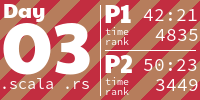
</a>

<a href="src/main/scala/adventofcode/y2023/Day11.scala">
  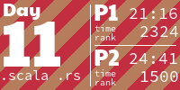
</a>
<a href="src/main/scala/adventofcode/y2023/Day12.scala">
  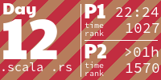
</a>
<a href="src/main/scala/adventofcode/y2023/Day13.scala">
  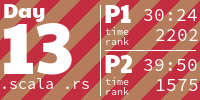
</a>

<a href="src/main/scala/adventofcode/y2023/Day18.scala">
  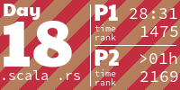
</a>
<a href="src/main/scala/adventofcode/y2023/Day19.scala">
  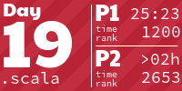
</a>
<a href="src/main/scala/adventofcode/y2023/Day20.scala">
  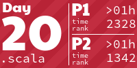
</a>
<a href="src/main/scala/adventofcode/y2023/Day21.scala">
  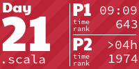
</a>

<a href="src/main/scala/adventofcode/y2023/Day23.scala">
  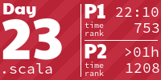
</a>

<h1 align="center">
  2022 - 50 ⭐
</h1>

<a href="src/main/scala/adventofcode/y2022/Day3.scala">
  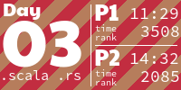
</a>

<a href="src/main/scala/adventofcode/y2022/Day13.scala">
  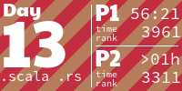
</a>

<a href="src/main/scala/adventofcode/y2022/Day17.scala">
  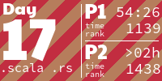
</a>

<a href="src/main/scala/adventofcode/y2022/Day22.scala">
  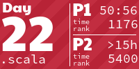
</a>

<a href="src/main/scala/adventofcode/y2022/Day24.scala">
  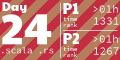
</a>
<a href="src/main/scala/adventofcode/y2022/Day25.scala">
  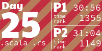
</a>
<h1 align="center">
  2021 - 50 ⭐
</h1>

<a href="src/main/scala/adventofcode/y2021/Day11.scala">
  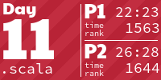
</a>

<a href="src/main/scala/adventofcode/y2021/Day13.scala">
  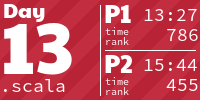
</a>

<a href="src/main/scala/adventofcode/y2021/Day21.scala">
  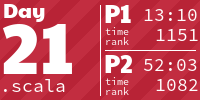
</a>

<a href="src/main/scala/adventofcode/y2021/Day25.scala">
  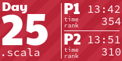
</a>
<h1 align="center">
  2020 - 50 ⭐
</h1>

<a href="src/main/scala/adventofcode/y2020/Day11.scala">
  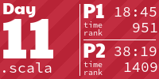
</a>

<a href="src/main/scala/adventofcode/y2020/Day13.scala">
  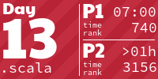
</a>
<a href="src/main/scala/adventofcode/y2020/Day14.scala">
  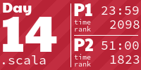
</a>

<a href="src/main/scala/adventofcode/y2020/Day16.scala">
  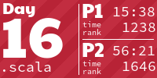
</a>

<a href="src/main/scala/adventofcode/y2020/Day18.scala">
  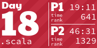
</a>

<a href="src/main/scala/adventofcode/y2020/Day23.scala">
  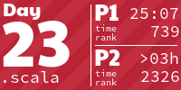
</a>
<a href="src/main/scala/adventofcode/y2020/Day24.scala">
  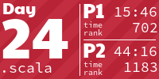
</a>

<h1 align="center">
  2019 - 50 ⭐
</h1>

<a href="src/main/scala/adventofcode/y2019/Day13.scala">
  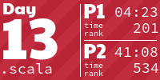
</a>
<a href="src/main/scala/adventofcode/y2019/Day14.scala">
  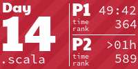
</a>

<a href="src/main/scala/adventofcode/y2019/Day16.scala">
  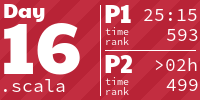
</a>

<a href="src/main/scala/adventofcode/y2019/Day19.scala">
  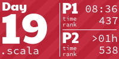
</a>
<a href="src/main/scala/adventofcode/y2019/Day20.scala">
  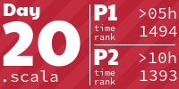
</a>

<a href="src/main/scala/adventofcode/y2019/Day23.scala">
  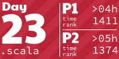
</a>

<h1 align="center">
  2018 - 50 ⭐
</h1>

<a href="src/main/scala/adventofcode/y2018/Day8.scala">
  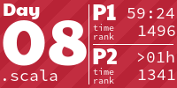
</a>

<a href="src/main/scala/adventofcode/y2018/Day13.scala">
  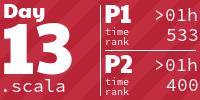
</a>
<a href="src/main/scala/adventofcode/y2018/Day14.scala">
  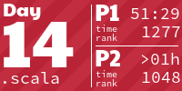
</a>

<h1 align="center">
  2016 - 50 ⭐
</h1>

<a href="src/main/scala/adventofcode/y2016/Day13.scala">
  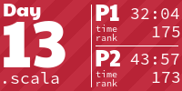
</a>
<a href="src/main/scala/adventofcode/y2016/Day14.scala">
  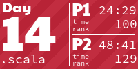
</a>

<a href="src/main/scala/adventofcode/y2016/Day21.scala">
  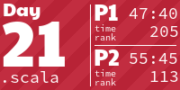
</a>

<h1 align="center">
  2015 - 50 ⭐
</h1>

<a href="src/main/scala/adventofcode/y2015/Day14.scala">
  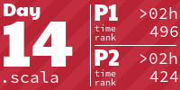
</a>

<!-- AOC TILES END -->
